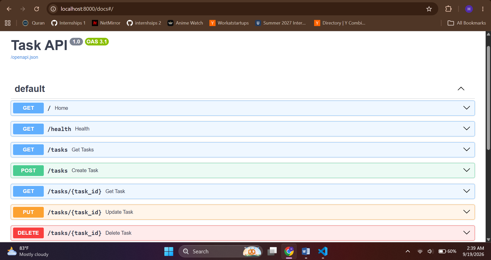
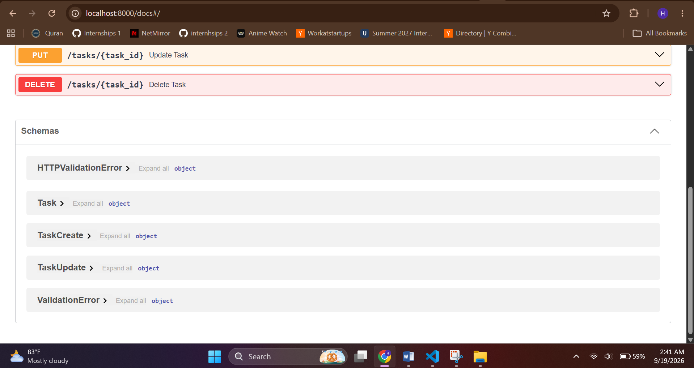

# Task API

A beginner-friendly CRUD API for managing tasks. Tasks are stored in an in-memory Python list, so all data is lost when the server restarts.

## Technologies

- Python
- FastAPI
- Uvicorn

## Setup and Run

Install the dependencies:

```bash
pip install -r requirements.txt
```

Start the server:

```bash
uvicorn main:app --reload
```

The API runs at:

```text
http://localhost:8000
```

Interactive Swagger UI is available at:

```text
http://localhost:8000/docs
```

## Endpoints

| Method | Endpoint | Purpose |
|---|---|---|
| GET | `/` | Show API information |
| GET | `/health` | Check API health |
| GET | `/tasks` | Return all tasks |
| GET | `/tasks/{task_id}` | Return one task |
| POST | `/tasks` | Create a task |
| PUT | `/tasks/{task_id}` | Update a task title and/or status |
| DELETE | `/tasks/{task_id}` | Delete a task |

## Examples

### Create a Task

```bash
curl -i -X POST http://localhost:8000/tasks -H "Content-Type: application/json" -d "{\"title\":\"Buy milk\"}"
```

Example successful response:

```text
HTTP/1.1 201 Created
content-type: application/json

{"id":4,"title":"Buy milk","done":false}
```

### Verified `curl -i` Output

```text
HTTP/1.1 200 OK
date: Fri, 18 Sep 2026 21:18:45 GMT
server: uvicorn
content-length: 15
content-type: application/json

{"status":"ok"}
```

### Update a Task

Example request using `PUT /tasks/4`:

```json
{
  "title": "Buy oat milk",
  "done": true
}
```

The response is the updated task.

### Error Handling

A missing task returns `404` with an error message:

```json
{
  "error": "Task 99 not found"
}
```

Invalid or empty request bodies return `400` with an error message.

## Swagger UI Screenshot


